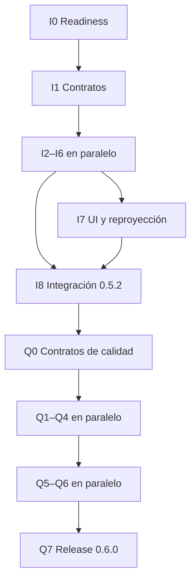

# Colaboración de agentes para Fase 5.2 y 6.0

Fecha: 2026-09-15

## Fuente de verdad

- Repositorio: `ravacholin/Diarioele`
- Base: `main@63c4be6cfe5c07f42dd91d8f6948b194e276da56`
- Rama de integración: `feature/phase5-2-quality`
- Diseño: `docs/superpowers/specs/2026-09-15-phase5-2-quality-design.md`
- Plan de integridad: `docs/superpowers/plans/2026-09-15-phase5-2-integrity.md`
- Plan de calidad: `docs/superpowers/plans/2026-09-15-phase6-quality-loop.md`

Los PR de tareas apuntan a `feature/phase5-2-quality`. Solo el PR integrador apunta a `main`.

## Reglas

- Un agente integrador es el único que actualiza este documento, `AGENTS.md` y `PHASE5_HANDOFF.md`.
- Cada agente trabaja en una rama propia creada desde el último head verde de integración.
- Las pruebas se escriben antes del código.
- Ningún test automático usa red o claves reales.
- Ninguna rama cambia proveedores, modelos o políticas de privacidad fuera del diseño.
- No se integran dos tareas no verificadas en un mismo checkpoint.
- Todo PR recibe revisión de especificación y revisión de calidad.
- Un cambio a un contrato congelado requiere un PR de contrato previo y rebase de las ramas dependientes.
- Los archivos reservados no se modifican sin coordinación explícita.

## Entrega 1: 0.5.2-integrity

### Ola I0

| Tarea | Rama | Responsable | Dependencia |
|---|---|---|---|
| I0 Baseline y continuidad | `feature/phase5-2-task-i0-readiness` | Integrador | ninguna |
| I1 Contratos de identidad y estado | `feature/phase5-2-task-i1-contracts` | Agente de contratos | I0 |

I1 congela `ClaimIdentity`, los estados semánticos, las interfaces de journal y la política estado→campo. Ninguna tarea posterior empieza antes de su integración verde.

### Ola I1, trabajo paralelo

| Tarea | Rama | Propiedad principal |
|---|---|---|
| I2 Orden temporal y presupuesto de paquetes | `feature/phase5-2-task-i2-packets` | `InterpretationPacketBuilder*` |
| I3 Proyección y composición de ficha | `feature/phase5-2-task-i3-projection` | projector, materializer, composer |
| I4 Persistencia y migración 5→6 | `feature/phase5-2-task-i4-persistence` | entidades, DAO, migración, store |
| I5 Deadlines y reparación del estado | `feature/phase5-2-task-i5-runtime` | router, retry, worker, journal |
| I6 Evaluación de integridad | `feature/phase5-2-task-i6-evaluation` | tests y evaluador offline |

I2, I3, I4, I5 e I6 pueden desarrollarse en paralelo después de I1. I4 es el único propietario del esquema Room. I5 consume sus interfaces con fakes hasta integrar I4.

### Ola I2

| Tarea | Rama | Dependencia |
|---|---|---|
| I7 Reproyección local y observabilidad básica | `feature/phase5-2-task-i7-ui-state` | I3, I4, I5 |
| I8 Integración y release 0.5.2 | `feature/phase5-2-task-i8-release` | I2–I7 |

## Entrega 2: 0.6.0-quality-loop

### Ola Q0

| Tarea | Rama | Propiedad principal |
|---|---|---|
| Q0 Contratos del ciclo de calidad | `feature/phase6-task-q0-contracts` | contratos compartidos |

Q0 se integra y queda verde antes de iniciar trabajo paralelo.

### Ola Q1, trabajo paralelo

| Tarea | Rama | Propiedad principal |
|---|---|---|
| Q1 Quality gate y normalización | `feature/phase6-task-q1-quality-gate` | evaluador semántico y números |
| Q2 Prompts, schemas y corrección real | `feature/phase6-task-q2-provider-quality` | prompt y adaptadores |
| Q3 Fusión local + IA | `feature/phase6-task-q3-hybrid-merge` | merger y reducción |
| Q4 Feedback y revisión por campo | `feature/phase6-task-q4-feedback` | revisiones, ViewModel y UI |
| Q4 Feedback y revisión por campo | `feature/phase6-task-q4-feedback` | revisiones, ViewModel y UI |

Q1–Q4 parten de Q0 verde. Q4 consume el esquema y journal integrados en I4/I5.

### Ola Q2, trabajo paralelo

| Tarea | Rama | Dependencia |
|---|---|---|
| Q5 Observabilidad completa | `feature/phase6-task-q5-observability` | Q4 |
| Q6 Backend de corpus local y JSONL | `feature/phase6-task-q6-local-corpus` | Q1, Q4 |

Q5 posee la UI durante esta ola. Q6 no modifica `CaptureViewModel` ni `CaptureScreen`; la integración visual del corpus pertenece a Q7.

### Ola Q3

| Tarea | Rama | Dependencia |
|---|---|---|
| Q7 Integración, release y benchmark | `feature/phase6-task-q7-release` | Q1–Q6 |

## DAG



## Archivos reservados

- `AGENTS.md`, `PHASE5_HANDOFF.md`, este documento: integrador.
- `InferenceModels.kt`, interfaces compartidas: I1; cambios posteriores requieren PR de contrato.
- `Entities.kt`, `SessionDao.kt`, `DiarioDatabase.kt`: I4 y luego Q4/Q6 en ese orden.
- `TranscriptionCoordinator.kt`: I3, luego I7, luego Q7.
- `TranscriptionWorker.kt`: I5, luego Q5.
- `CaptureViewModel.kt`, `CaptureScreen.kt`: I7, luego Q4/Q5 con integración secuencial.
- `app/build.gradle.kts` y protocolos de dispositivo: I8 y Q8.
- `.github/workflows/android-apk.yml`: integrador o tarea de release.

## Contrato de entrega

Cada PR debe incluir:

```text
Task:
Base SHA:
Head SHA:
Archivos:
Interfaces consumidas:
Interfaces producidas:
Pruebas y resultado:
Métricas verificadas:
Workflow:
Secret scan:
Red real en CI: no
Riesgos:
Siguiente dependencia:
```

## Checkpoint del integrador

Después de cada PR:

1. confirmar que la base coincide con el último head verde;
2. revisar alcance y archivos reservados;
3. ejecutar pruebas específicas;
4. ejecutar contratos compartidos;
5. esperar GitHub Actions verde;
6. integrar un solo PR;
7. actualizar el handoff con PR, SHA, workflow y próxima ola;
8. informar qué ramas quedan habilitadas.

## Condiciones de cierre

`0.5.2-integrity` se integra a `main` solamente después de CI verde, migración v5 poblada y prueba física de orden, tarea, modo local, timeout y reapertura.

`0.6.0-quality-loop` se integra solamente después de Q0–Q7 verdes, reporte de evaluación offline, prueba de feedback/corpus, benchmark manual de proveedores y prueba física completa en Moto g max.
