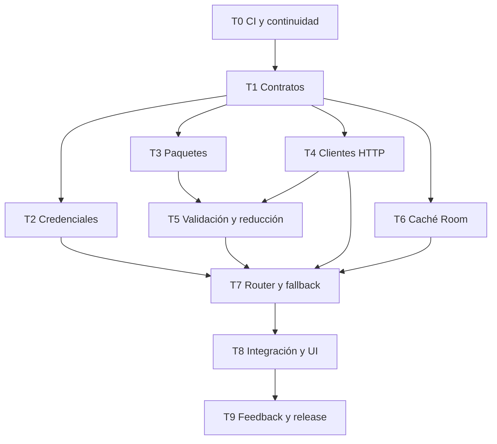

# Colaboración de agentes para la Fase 5

Fecha: 2026-09-14

## Propósito

Este documento organiza la implementación de la interpretación contextual de DiarioELE entre varios agentes. Complementa y, para la mecánica de ramas e integración, prevalece sobre:

- `docs/superpowers/specs/2026-09-14-contextual-interpretation-design.md`
- `docs/superpowers/plans/2026-09-14-contextual-interpretation.md`

El plan técnico define qué construir. Este documento define quién puede construir cada parte, cuándo puede empezar, cómo se entrega y cómo se integra sin perder cambios.

## Fuente de verdad

- Repositorio: `ravacholin/Diarioele`
- Base funcional inmutable: `feature/phase4-whisper-recovery`
- Rama de integración: `feature/phase5-contextual-interpretation`
- Diseño aprobado: `docs/superpowers/specs/2026-09-14-contextual-interpretation-design.md`
- Plan ejecutable: `docs/superpowers/plans/2026-09-14-contextual-interpretation.md`
- Estado y siguiente paso: `PHASE5_HANDOFF.md`

Ningún agente debe trabajar directamente sobre la rama de Fase 4 ni reescribir su historia. La Fase 5 no modifica el motor Whisper, sus ventanas, checkpoints ni política de conservación.

## Reglas no negociables

- No incorporar servicios, modelos ni endpoints fuera del catálogo gratuito fijo.
- No aceptar ids de modelos escritos por el usuario.
- No enviar audio, rutas, ids internos ni metadatos personales.
- No guardar claves en código, Room, logs, backups, excepciones o fixtures.
- No usar red ni claves reales en pruebas automáticas.
- No ejecutar proveedores en paralelo.
- No sobrescribir campos editados por el usuario.
- No borrar audio, transcripción, evidencia, caché válida ni borradores ante un fallo.
- No afirmar que una tarea terminó hasta tener pruebas locales y GitHub Actions verdes.
- No incluir Cloudflare, Mistral, servidor propio ni un segundo modelo local en esta fase.

## Modelo de ramas

Cada tarea se implementa en una rama corta creada desde el último head verde de la rama de integración:

| Tarea | Rama recomendada |
|---|---|
| 0 | `feature/phase5-contextual-interpretation` (integrador) |
| 1 | `feature/phase5-task-01-contracts` |
| 2 | `feature/phase5-task-02-credentials` |
| 3 | `feature/phase5-task-03-packets` |
| 4 | `feature/phase5-task-04-provider-clients` |
| 5 | `feature/phase5-task-05-validation` |
| 6 | `feature/phase5-task-06-cache` |
| 7 | `feature/phase5-task-07-router` |
| 8 | `feature/phase5-task-08-integration-ui` |
| 9 | `feature/phase5-task-09-release` |

Cada rama abre un PR contra `feature/phase5-contextual-interpretation`, nunca contra `main`. Un agente integrador fusiona los PR en el orden autorizado. No se permite que dos agentes escriban simultáneamente en una misma rama.

## Dependencias y olas de ejecución



### Readiness: habilitar colaboración

Task 0 actualiza CI, continuidad y fuentes de verdad. Ningún agente empieza Task 1 hasta que el baseline de la rama de integración esté verde.

### Ola 0: congelar contratos

Solo un agente ejecuta Task 1. Hasta que su PR esté integrado y verde, ninguna tarea de producción comienza. Task 1 fija modelos, enums, errores, interfaces y escenarios sintéticos comunes.

### Ola 1: tres trabajos paralelos

Después de integrar Task 1 pueden comenzar en paralelo:

- Task 2: catálogo, consentimiento y credenciales.
- Task 3: creación determinista de paquetes.
- Task 4: prompt y clientes HTTP.

Task 4 puede importar contratos de Task 1, pero no debe inventar variantes propias. Task 2 y Task 4 coordinan exclusivamente mediante `ProviderProfile` y el store de credenciales.

### Ola 2: validación y persistencia

- Task 5 empieza cuando Tasks 3 y 4 estén integradas.
- Task 6 puede empezar después de Task 1, pero se integra después de revisar las migraciones y antes de Task 7.

Task 5 y Task 6 pueden desarrollarse en paralelo en ramas distintas. Si ambas necesitan tocar `FullJourneyTest.kt`, la prueba integral queda reservada para Task 6 o para el integrador.

### Ola 3: composición

Task 7 comienza únicamente con Tasks 2, 4, 5 y 6 verdes e integradas. El router no redefine clientes, caché ni validador: solo los compone y aplica la política de rutas.

### Ola 4: producto y cierre

- Task 8 conecta el router al procesamiento y expone configuración/estado.
- Task 9 agrega feedback, migración final, protocolo físico, versión, documentación y APK.

Tasks 8 y 9 son secuenciales porque comparten composición, UI, base de datos y pruebas de recorrido completo.

## Propiedad de archivos

| Tarea | Propiedad principal | No debe modificar |
|---|---|---|
| 1 | `processing/semantic/InferenceModels.kt`, interfaz, evidencia múltiple, claves de claim, estado→campo y fixtures | UI, Room, transporte real |
| 2 | catálogo gratuito, consentimiento, Keystore y sus pruebas | endpoints, router, Room |
| 3 | `InterpretationPacketBuilder` y sus pruebas | clientes, UI, entidades |
| 4 | prompt, transporte y adaptadores de proveedores | Keystore, Room, coordinator |
| 5 | validador, reductor, procedencia y projector | transporte, credenciales, UI |
| 6 | entidades, DAO, migración 4→5, caché y cleanup | router, clientes, UI |
| 7 | router, retry y adaptación del extractor literal | UI, migraciones, Whisper |
| 8 | coordinator, worker, composición y pantallas | esquema Room salvo coordinación |
| 9 | feedback, migración 5→6, versión, protocolo y handoff | semántica ya validada |

## Archivos de integración reservados

Estos archivos tienen alto riesgo de conflicto. Solo los modifica la tarea asignada o el agente integrador:

- `app/build.gradle.kts`: Tasks 4 y 9, en ese orden.
- `app/src/main/AndroidManifest.xml`: Task 4.
- `app/src/main/java/com/capo/diarioclase/data/db/Entities.kt`: Tasks 6 y 9.
- `app/src/main/java/com/capo/diarioclase/data/db/SessionDao.kt`: Tasks 6 y 9.
- `app/src/main/java/com/capo/diarioclase/data/db/DiarioDatabase.kt`: Tasks 6 y 9.
- `app/src/main/java/com/capo/diarioclase/DiarioClaseApp.kt`: Task 8.
- `app/src/main/java/com/capo/diarioclase/processing/work/TranscriptionCoordinator.kt`: Task 8.
- `app/src/test/java/com/capo/diarioclase/FullJourneyTest.kt`: Tasks 6 y 9.
- `app/src/main/java/com/capo/diarioclase/diary/cleanup/CleanupCoordinator.kt`: Task 6.
- `app/src/main/java/com/capo/diarioclase/processing/evidence/LiteralClaimExtractor.kt`: Task 7.
- `.github/workflows/android-apk.yml`: integrador en Task 0 y Task 9.
- `AGENTS.md` y `PHASE5_HANDOFF.md`: agente integrador.

Si una tarea descubre que necesita modificar un archivo reservado ajeno, se detiene y lo declara en su handoff. No amplía el alcance silenciosamente.

## Contrato de entrega de cada agente

Cada PR de tarea debe incluir en su descripción:

1. Task exacta y requisito cubierto.
2. Commit base usado.
3. Archivos creados y modificados.
4. Pruebas ejecutadas con comando y resultado.
5. Riesgos o decisiones no previstas.
6. Confirmación de que no contiene secretos.
7. Confirmación de que las pruebas no usan red.
8. SHA final y enlace al workflow.
9. Qué necesita el siguiente agente.

Formato mínimo:

```text
Task:
Base SHA:
Head SHA:
Cambios:
Pruebas:
Workflow:
Secret scan:
Red real en CI: no
Riesgos:
Siguiente dependencia:
```

## Revisión obligatoria

Cada tarea recibe dos revisiones antes de integrarse:

1. Revisión de especificación: verifica que se implementó exactamente la tarea, sin ampliar proveedores ni relajar privacidad/costo.
2. Revisión de calidad: contratos, tests, errores, concurrencia, persistencia y regresiones.

Los comentarios críticos o importantes bloquean la integración. Los menores pueden registrarse como deuda solo si no afectan privacidad, pérdida de datos, costo, corrección semántica o estabilidad.

## Checkpoint de integración

Después de fusionar cada tarea, el integrador:

1. actualiza la rama local desde GitHub;
2. ejecuta las pruebas específicas de la tarea;
3. ejecuta las pruebas de contratos compartidos;
4. confirma GitHub Actions verde;
5. actualiza `PHASE5_HANDOFF.md` con SHA, workflow, estado y siguiente tarea;
6. anuncia qué ramas de la próxima ola ya pueden comenzar.

No se mezclan dos tareas no verificadas en un único checkpoint.

## Política ante cambios de contrato

Los contratos de Task 1 quedan congelados al integrarse. Si una tarea posterior requiere cambiarlos:

- abre primero un PR pequeño de contrato;
- explica qué tarea está bloqueada;
- actualiza fixtures y pruebas de contrato;
- obtiene aprobación del integrador;
- solo entonces rebasea las ramas dependientes.

No se duplican enums, modelos o políticas para evitar esta coordinación.

## Definición de terminado de la Fase 5

La fase solo está terminada cuando:

- Tasks 1 a 9 están integradas y sus workflows están verdes;
- los tres proveedores y el fallback local tienen pruebas deterministas;
- el APK no contiene claves y solo admite el catálogo gratuito;
- el protocolo físico se completa en Moto g max;
- el usuario valida éxito primario, fallback remoto y fallback local;
- `PHASE5_HANDOFF.md` registra el APK exacto, SHA y resultados;
- el PR de Fase 5 está listo para revisión final.

La colaboración puede acelerar tareas independientes, pero la evidencia de cierre sigue siendo secuencial y verificable.
